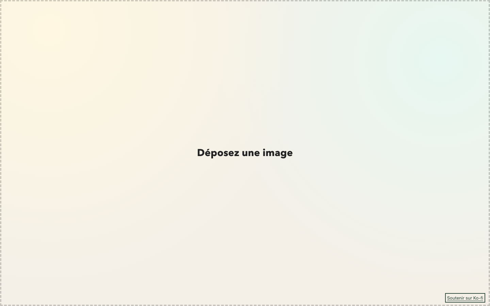

# ImgRalph


[FR](README.md) · [EN](README_en.md)

PK · version **2026.10.05**

Remove image backgrounds with remove.bg (API, default) or locally in your browser with ONNX and rembg-web. API mode sends the image to the external service.



## Features

- Drag and drop or pick a PNG/JPG/WebP file.
- Fullscreen progress and transparent PNG download.
- Automatic cropping with a 1 px border.
- Cutout slider from −50 to 200 and local models u2net, u2netp, u2net_human_seg.

## Installation and usage

No build step. API mode requires PHP with cURL and a server-side key configured as described in [secrets/README.md](secrets/README.md).

```sh
php -S localhost:4173 -t src
```

Open http://localhost:4173, drop an image, then click “Télécharger” when processing finishes. Local mode downloads its dependencies and model; a modern browser with WebAssembly is required.

To view the FR/EN promotional page:

```sh
python3 -m http.server 4174
```

Open http://localhost:4174/store/website/index.html. The landing shows an animated drop-to-result sequence with a synthwave car and a Ko-fi support button; this promotional processing is simulated and uploads no image. The previous version remains in `store/v1/`.

## History

See the [CHANGELOG](CHANGELOG.md).

## Support

Support this project on [Ko-fi](https://ko-fi.com/pouark).
